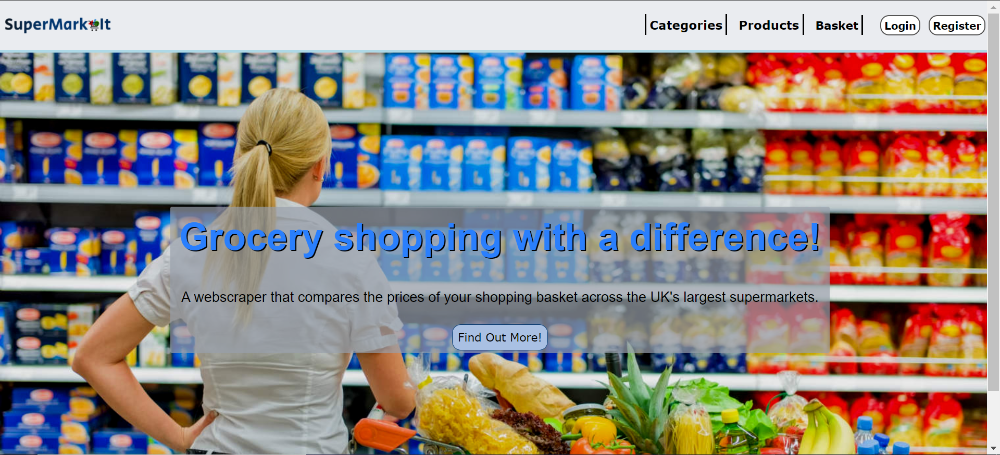
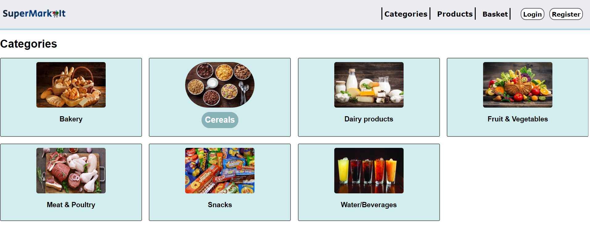
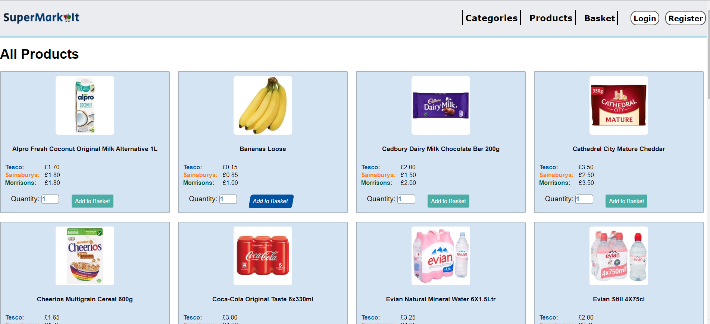
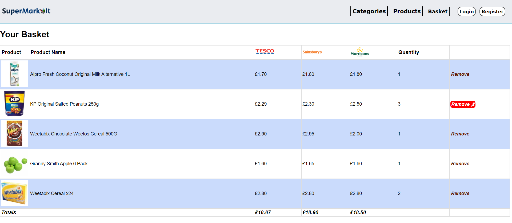

# Price Comparison Project (SuperMarkIt)
A webscraper for the Django Framework that compares the product prices for various UK supermarkets.

# Table of Contents
- [Introduction](https://github.com/RamonWill/price-comparison-project#Introduction)
- [Installation](https://github.com/RamonWill/price-comparison-project#Installation)
- [About](https://github.com/RamonWill/price-comparison-project#About)
- [Credits](https://github.com/RamonWill/price-comparison-project#Credit)
- [Video Demo](https://github.com/RamonWill/price-comparison-project#Video-Demo)
- [Screenshots](https://github.com/RamonWill/price-comparison-project#Screenshots)

# Introduction
This Project (SuperMarkIt) utilises the power of the webscraping library Beautiful Soup  and Django to create a price comparison site. 

# Installation
If you do not have Python 3.7+, you can download it [here](https://www.python.org/downloads/release/python-370/, "here").
If you do not have Django you can download it [here](https://docs.djangoproject.com/en/3.0/topics/install/)

# About
SuperMarkit uses a webscraping script that traverses through the URLs of the Leading UK supermarkits stored in the database. It then scrapes the prices from the website pages and updates the database with the latest prices. As it currently stands users can register to create an account and store items in a basket, there is not a checkout page yet.

# Credits
I'd like to thank The Net Ninja who created [this tutorial](https://www.youtube.com/watch?v=n-FTlQ7Djqc, "this tutorial") that taught me the basics of Django. I'd also like to thank [this tutorial](https://www.youtube.com/watch?v=YZvRrldjf1Y) by FreeCodeCamp, that helped me greatly on this project.

# Video-Demo
The image below will redirect you to the video demo on Youtube

# Screenshots

